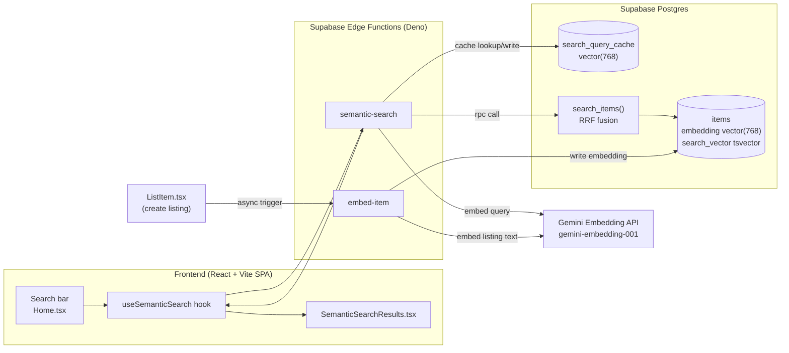
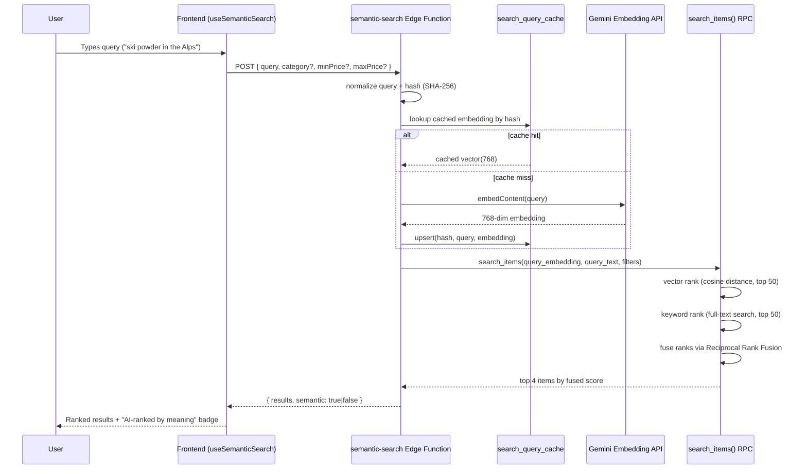

# ORentit

ORentit is a rental marketplace with a **semantic search engine** built on top of it. Instead of matching keywords, search queries are embedded into a vector space and compared against pre-embedded listings, so a query like *"ski powder in the Alps"* or *"shoot wildlife at golden hour"* returns relevant gear and locations even when none of those words appear in the listing text.

Under the hood: listing and query text is embedded with Google's `gemini-embedding-001`, stored as `vector(768)` columns in Postgres via the **pgvector** extension, retrieved with an HNSW cosine-similarity index, and fused with Postgres full-text search results through Reciprocal Rank Fusion — so exact matches ("Tesla") and semantic matches ("a fast electric car") both surface correctly.

## Table of Contents

- [AI Features](#ai-features)
- [System Architecture](#system-architecture)
- [How Semantic Search Works](#how-semantic-search-works)
- [Tech Stack](#tech-stack)
- [Demo Experience](#demo-experience)
- [Development](#development)
- [Deployment](#deployment)

## AI Features

| Feature | Implementation |
|---|---|
| **Semantic search** | User queries are embedded (Gemini, 768-dim) and matched against item embeddings by cosine distance, instead of relying on literal keyword overlap. |
| **Vector similarity retrieval** | `pgvector` `embedding` column on `items`, indexed with `hnsw (embedding vector_cosine_ops)` for approximate nearest-neighbor search at query time. |
| **Hybrid ranking (Reciprocal Rank Fusion)** | A single SQL function (`search_items`) ranks candidates by vector similarity *and* by Postgres full-text search (`tsvector`/`websearch_to_tsquery`), then fuses both rankings with RRF (`1/(60+rank)`) so neither exact keyword matches nor purely semantic matches get buried. |
| **Query embedding cache** | Query embeddings are hashed (SHA-256) and cached in `search_query_cache`, so repeated or demo queries skip the embedding API call entirely. |
| **Graceful degradation** | If the Gemini API call fails or is unavailable, the system automatically falls back to full-text-only search rather than failing the request — the frontend surfaces this via a `semantic: false` flag. |
| **Async embedding on write** | New listings are embedded out-of-band after creation (via an Edge Function), so writes aren't blocked on an external API call. |

What this is **not**: there is no separate LLM call that re-reads and re-scores candidates after retrieval, and no NLU step that extracts structured filters (price, dates, location) from free text — ranking is entirely vector + full-text fusion at the database layer, and filters are passed explicitly by the caller.

## System Architecture

### Diagram 1 — High-Level Architecture



### Diagram 2 — Search Pipeline Flow



If the embedding call fails, `query_embedding` is passed as `null`, the vector branch of `search_items` returns nothing, and results fall back to full-text ranking alone (`semantic: false`).

## How Semantic Search Works

**Embedding listings.** When an item is created (`ListItem.tsx`), an Edge Function (`embed-item`) is triggered asynchronously. It concatenates `name`, `description`, `category`, and `location` into one string, sends it to `gemini-embedding-001`, and stores the resulting 768-dimension vector in `items.embedding`. A backfill script (`supabase/backfill_embeddings.ts`) re-embeds existing rows the same way.

**Embedding queries.** A search request normalizes the query text (lowercase, trimmed, collapsed whitespace), hashes it, and checks `search_query_cache` before calling the embedding API — so identical queries are essentially free on repeat.

**Similarity search.** Postgres compares the query vector against every listing's `embedding` using the `<=>` cosine-distance operator, accelerated by an `hnsw` index (`items_embedding_idx`), and returns the 50 closest listings.

**Ranking.** Pure vector similarity isn't enough on its own — it can miss exact matches on names/brands. So `search_items()` runs a second branch using Postgres full-text search (`search_vector`, a generated `tsvector` column with a GIN index) and ranks those results with `ts_rank_cd`. Both rankings are fused with Reciprocal Rank Fusion (`score = 1/(60+vector_rank) + 1/(60+keyword_rank)`), and the combined top results are returned.

**Why this beats keyword search.** Keyword search only matches literal tokens. A listing described as "an electric hatchback, great for city trips" will never match a search for "fast EV" under pure keyword matching, but it will under embeddings, because the model captures meaning rather than exact wording. Fusing in full-text search keeps the system from losing the cases keyword search is actually good at — exact names, brands, locations.

## Tech Stack

**Frontend**
- React 18 + TypeScript, built with Vite
- React Router v6 (client-side routing)
- Tailwind CSS, Headless UI, Radix UI primitives, Framer Motion

**AI / Search**
- Google Gemini (`gemini-embedding-001`, 768-dim embeddings) called server-side from Edge Functions
- Supabase Postgres + `pgvector` (HNSW, cosine similarity)
- Postgres full-text search (`tsvector`/`GIN`) fused with vector results via Reciprocal Rank Fusion

**Backend / Data**
- Supabase: Postgres, Auth, Row-Level Security, Edge Functions (Deno)
- `@supabase/supabase-js` client, no ORM — SQL migrations + RPC functions

**Payments**
- Stripe (`@stripe/stripe-js`, `@stripe/react-stripe-js`)

**Tooling**
- ESLint, TypeScript, ts-node (for seed/backfill scripts)

## Demo Experience

To see the semantic layer in action rather than just reading about it:

1. Open the search bar on the home page and try a query that has **no literal keyword overlap** with a listing, e.g. `ski powder in the Alps` or `shoot wildlife at golden hour`.
2. Watch the "thinking" state (`Interpreting intent… → Searching semantic space… → Ranking relevant experiences…`) — this reflects the real request lifecycle: query embedding → vector search → fused ranking, not a fake loading spinner.
3. Look for the **"AI-ranked by meaning"** badge on results — this means `semantic: true` was returned, i.e. the embedding call succeeded and results came from the fused vector+keyword ranking.
4. Try the same query twice. The second call should resolve faster since the query embedding is served from `search_query_cache` instead of calling Gemini again.
5. Try a literal/exact query (e.g. a listing's exact name) to see the full-text branch contribute — both signals are fused, not mutually exclusive.

## Development

1. Clone the repository
```bash
git clone https://github.com/Fouad-Smaoui/ORentit.git
cd ORentit
```

2. Install dependencies
```bash
npm install
```

3. Create a `.env` file based on `.env.example`
```bash
cp .env.example .env
```

4. Add your Supabase credentials to `.env`, plus a `GEMINI_API_KEY` (used by the `embed-item` and `semantic-search` Edge Functions to call the Gemini embedding API).

5. Apply database migrations (creates the `items.embedding` column, HNSW index, `search_query_cache` table, and `search_items` RPC):
```bash
supabase db push
```

6. (Optional) Backfill embeddings for existing listings:
```bash
npm run backfill-embeddings
```

7. Start the development server
```bash
npm run dev
```

## Deployment

### Vercel Deployment

1. Push your code to GitHub
2. Visit [Vercel](https://vercel.com) and create a new project
3. Import your GitHub repository
4. Configure the following environment variables in Vercel:
   - `VITE_SUPABASE_URL`
   - `VITE_SUPABASE_ANON_KEY`
5. Deploy!

### Supabase Edge Functions

The `embed-item` and `semantic-search` functions must be deployed to Supabase separately, with `GEMINI_API_KEY` and `SUPABASE_SERVICE_ROLE_KEY` set as function secrets:
```bash
supabase functions deploy semantic-search
supabase functions deploy embed-item
supabase secrets set GEMINI_API_KEY=your-key
```

## License

This project is licensed under the MIT License - see the [LICENSE](LICENSE) file for details.
